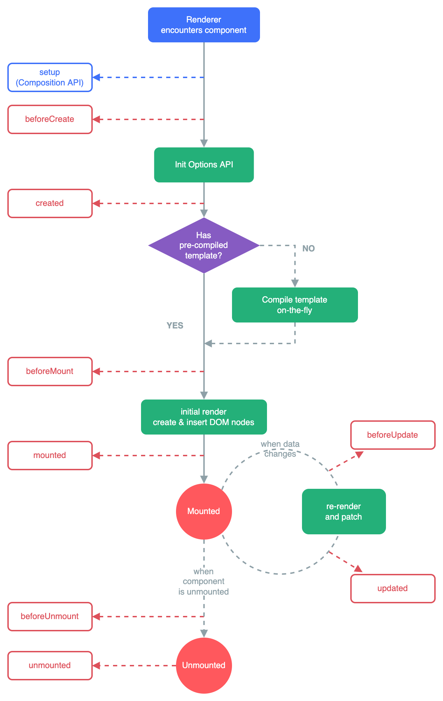

## 生命周期钩子

<https://cn.vuejs.org/api/composition-api-lifecycle.html>

## onBeforeMount()

注册一个钩子，在组件被挂载之前被调用。

### 类型

```ts
function onBeforeMount(callback: () => void): void
```

### 详细信息

当这个钩子被调用时，组件已经完成了其响应式状态的设置，但还没有创建 DOM 节点。它即将首次执行 DOM 渲染过程。

这个钩子在服务器端渲染期间不会被调用。

## onMounted()

注册一个回调函数，在组件挂载完成后执行。

### 类型

```ts
function onMounted(callback: () => void): void
```

### 详细信息

组件在以下情况下被视为已挂载：

- 其所有同步子组件都已经被挂载 (不包含异步组件或 `<Suspense>` 树内的组件)。

- 其自身的 DOM 树已经创建完成并插入了父容器中。注意仅当根容器在文档中时，才可以保证组件 DOM 树也在文档中。

这个钩子通常用于执行需要访问组件所渲染的 DOM 树相关的副作用，或是在服务端渲染应用中用于确保 DOM 相关代码仅在客户端执行。

这个钩子在服务器端渲染期间不会被调用。

## onBeforeUpdate()

注册一个钩子，在组件即将因为响应式状态变更而更新其 DOM 树之前调用。

### 类型

```ts
function onBeforeUpdate(callback: () => void): void
```

### 详细信息

这个钩子可以用来在 Vue 更新 DOM 之前访问 DOM 状态。在这个钩子中更改状态也是安全的。

这个钩子在服务器端渲染期间不会被调用。

## onUpdated()

注册一个回调函数，在组件因为响应式状态变更而更新其 DOM 树之后调用。

### 类型

```ts
function onUpdated(callback: () => void): void
```

### 详细信息

父组件的更新钩子将在其子组件的更新钩子之后调用。

这个钩子会在组件的任意 DOM 更新后被调用，这些更新可能是由不同的状态变更导致的，因为多个状态变更可以在同一个渲染周期中批量执行（考虑到性能因素）。

如果你需要在某个特定的状态更改后访问更新后的 DOM，请使用 nextTick() 作为替代。

## onUnmounted()

注册一个回调函数，在组件实例被卸载之后调用。

### 类型

```ts
function onUpdated(callback: () => void): void
```

### 详细信息

一个组件在以下情况下被视为已卸载：

- 其所有子组件都已经被卸载。

- 所有相关的响应式作用 (渲染作用以及 setup() 时创建的计算属性和侦听器) 都已经停止。

可以在这个钩子中手动清理一些副作用，例如计时器、DOM 事件监听器或者与服务器的连接。

这个钩子在服务器端渲染期间不会被调用。

## onBeforeUnmount()

注册一个钩子，在组件实例被卸载之前调用。

### 类型

```ts
function onBeforeUnmount(callback: () => void): void
```

### 详细信息

当这个钩子被调用时，组件实例依然还保有全部的功能。

这个钩子在服务器端渲染期间不会被调用。

## 生命周期图示


